# Web Dinamis
Pembagian jenis website di bagi menjadi dua bagian yaitu web statis dan web dinamis. Web statis adalah website yang hanya menampilkan sebuah output dari hasil program yang telah diketikkan sedangkan web dinamis adalah sebuah web yang lebih kompleks karena kita dapat memberi input pada website dan website tersebut dapat menyimpan data yang kita masukkan.
# PHP
PHP (Hypertext Preprocessor) adalah sebuah bahasa skrip dengan fungsi umum yang terutama digunakan untuk pengembangan sebuah web dinamis ataupun website interaktif. PHP juga mendukung banyak jenis database seperti MySQL, PostgreSQL dan Oracle sehingga pembangunan sebuah website dapat menjadi lebih kompleks.

## Penggunaan Awal PHP 
untuk penggunaan awal PHP kita harus mengikuti langkah langkah berikut.
1) Buka XAMPP lalu aktifkan "MySQL" dan "Apache". 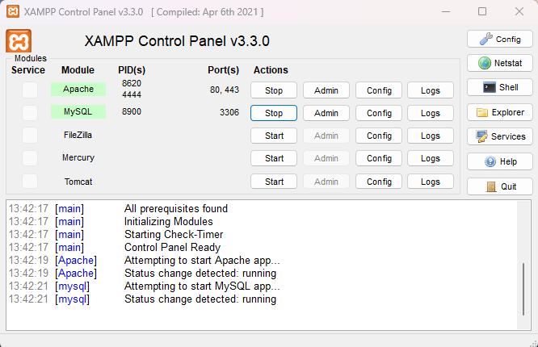
2) Masuk ke directory C.
   [Gambar](aset/2.png)
3) Buka folder XAMPP lalu buka folder Htdocs.![[3.png]]
4) Buat folder dengan nama yang anda inginkan.
5) Kemudian Masuk ke VSCode lalu klik "Open Folder" dan pilih folder yang telah anda buat.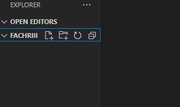
5) Buat Dokumen dengan ekstensi "php".
   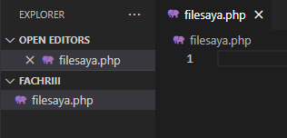
 
6) Untuk mengetikkan program php, dokemnnya selalu dibuka dengan "`<?php`" dan di akhiri dengan `?>`.
   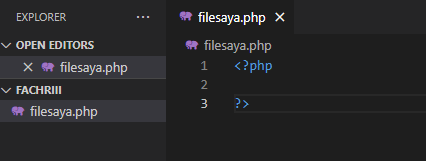
7) Anda telah dapat membuat kode program PHP sesuai dengan keinginan anda.
## Echo & Komentar 
Dalam php kita dapat mengetikkan sesuatu dengan kode "echo" dan menambahkan membuat sebuah komentar di penulisan program untuk penjelasan lebih lanjutnya akan dijelaskan di bawah ini. Dalam penulisan echo terdapat dua cara yaitu dengan kutip satu dan kutip dua, lalu untuk perbedaan antara keduanya akan dijelaskan lebih lanjut dibawah ini.
### Echo kutip satu
Untuk penulisan echo dengan kutip satu hasil yang akan tampil adalah seluruh yang ditulis di dalamnya dan hasil yang tampil akan terhitung sebagai string, walaupun ada variable yang dituliskan di dalam kutipnya. Untuk contoh programnya akan seperti berikut.
```php
echo 'Jumlah meja di kelas '. $meja . ' buah';
    echo "<br>";
```
### Echo kutip dua
Sedangkan untuk penulisan kutip dua akan menampilkan hasil dari variable maupun konstanta walapaun ditulis dalam kutip yang sama. Dan untuk contoh cara pengaplikasiannya akan seperti dibawah ini.
```php
echo "Shalat dlu, nabilang pak $wali_kelas dan $ketua_kelas";
    echo "<br>";
    echo "Kalau tidak, diracca' sama ketua gang $ketua_geng";
    echo "<br>";
```

### Komentar
Lalu untuk membuat komentar dalam kode program kita, kita dapat menggunakan dua cara yaitu `//` untuk komentar satu baris dan `/* */` untuk komentar multi baris. Dan untuk cara pengaplikasiaanya akan seperti di bawah ini
```php
//ini komentar satu baris
/*ini komentar
multi baris*/
```

## Variable & Konstanta
Dalam php kita dapat menuliskan variable dan kosntanta untuk menyimpan data yang akan digunakan kedepannya, untuk penjelasan lebih lanjutnya akan dijelaskan di bawah ini.
### Variable
Untuk penulisan variable kita awali dengan `$` lalu menuliskan nama variable nya dan menuliskan nilainya setelahnya dan di akhiri dengan `;`. Untuk contoh penggunaannya akan seperti di bawah ini.
```php
$meja = 30;
    $tk_kelas = "XI";
    $ketua_kelas = "July";
    $wali_kelas = "Saleh";
```

### Konstanta
Untuk konstanta berfungsi untuk menetapkan nilai dari sebuah data agar tidak dapat di ganti ganti kedepannya. Lalu untuk cara penulisannya akan seperti di bawah ini.
```php
const KEPSEK = "Herwelis";
define ('kelas', 'RPL 1');
```

## Operator
Dalam php juga kita dapat menggunakan operator operator untuk memudahkan penulisan program kita, Untuk penjelasan lebih jelasnya akan di dijelaskan di bawah.
### Aritmatika
Operator aritmatika berfungsi untuk penjumlah, pengurangan, perkalian dan pembagian. Untuk penggunaan akan seperti di bawah ini.
1. Penjumlahan
```php
    $a = 10;
    $b = 5;
    //Penambahan
    $penambahan = $a + $b;
    echo "penambahan: " . $Penambahan . "<br>";

```
**Hasil :**
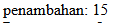
> [! info]- Analisis penjumlahan
>> `$a = 10;` : berfungsi sebagai variable yang memiliki nilai "10"
>> `$b = 5;` : berfungsi sebagai variable yang memiliki nilai "5"
>> `$penambahan = $a + $b;` : `$penambahan` berfungsi menyimpan variable dari hasil dari variable `$a` dan `$b`.
>> `echo "penambahan: " .$penambahan . "<br>;"` berfungsi untuk menampilkan hasil dari penambahan variable `$a` dan `$b`.

**Kesimpulan :**
operator `+` berfungsi untuk menjumlahkan isi dari variable yang kita ketikkan, dan hasilnya dapat kita tampilkan menggunakan echo.


2. Pengurangan
```php
	//pengurangan
    $Pengurangan = $a - $b;
    echo "Pengurangan: " . $Pengurangan . "<br>";
```
**Hasil :**
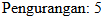

> [! info]- Analisis pengurangan
>> `$a = 10;` : berfungsi sebagai variable yang memiliki nilai "10"
>> `$b = 5;` : berfungsi sebagai variable yang memiliki nilai "5"
>> `$penambahan = $a - $b;` : `$pengurangan` berfungsi menyimpan variable dari hasil dari variable `$a` dan `$b`.
>> `echo "pengurangan: " .$pengurangan . "<br>;"` berfungsi untuk menampilkan hasil dari pengurangan variable `$a` dan `$b`.

**Kesimpulan :**
operator `-` berfungsi untuk menguragi isi dari variable yang kita ketikkan, dan hasilnya dapat kita tampilkan menggunakan echo.

3. Perkalian
```php
	//perkalian
    $Perkalian = $a * $b;
    echo "Perkalian: " . $Perkalian . "<br>";
```
**Hasil :**
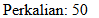

> [! info]- Analisis perkalian
>> `$a = 10;` : berfungsi sebagai variable yang memiliki nilai "10"
>> `$b = 5;` : berfungsi sebagai variable yang memiliki nilai "5"
>> `$perkalian = $a + $b;` : `$perkalian` berfungsi menyimpan variable dari hasil dari variable `$a` dan `$b`.
>> `echo "perkalian: " .$perkalian . "<br>;"` berfungsi untuk menampilkan hasil dari perkalian variable `$a` dan `$b`.

**Kesimpulan :**
operator `*` berfungsi untuk mengkali isi dari variable yang kita ketikkan, dan hasilnya dapat kita tampilkan menggunakan echo.

4. Pembagian
```php
	//pembagian
    $pembagian = $a / $b;
    echo "pembagian: " . $pembagian . "<br>";
```
**Hasil :**


> [! info]- Analisis pembagian
>> `$a = 10;` : berfungsi sebagai variable yang memiliki nilai "10"
>> `$b = 5;` : berfungsi sebagai variable yang memiliki nilai "5"
>> `$pembagian = $a + $b;` : `$pembagian` berfungsi menyimpan variable dari hasil dari variable `$a` dan `$b`.
>> `echo "pembagian: " .$pembagian . "<br>;"` berfungsi untuk menampilkan hasil dari pembagian variable `$a` dan `$b`.

**Kesimpulan :**
operator `/` berfungsi untuk membagi isi dari variable yang kita ketikkan, dan hasilnya dapat kita tampilkan menggunakan echo.


### Perbandingan
Operator perbandingan atau operator perbandingan digunakan untuk membandingkan 2 operan atau lebih. Pada umumnya Operator perbandingan digunakan pada kondisi if-else sebagai penentu tingkat kesesuaian.

1. Perbandingan ==
```php
$a = 5;
$b = 10;
// Operator perbandingan ==
if ($a == $b) {
    echo "Nilai a sama dengan nilai b";
} else {
    echo "Nilai a tidak sama dengan nilai b";
}
```
**Hasil :**


> [! info]- Analisis pembagian ==
>> `$a = 5;` : berfungsi sebagai variable yang memiliki nilai "5"
>> `$b = 10;` : berfungsi sebagai variable yang memiliki nilai "10"
>> `if ($a == $b) { echo "Nilai a sama dengan nilai b";` : jika nilai `$a` dan nilai `$b` sama makan akan menampilkan "Nilai a sama dengan nilai b"
>> `} else { echo "Nilai a tidak sama dengan nilai b";}` : Namun jika nilai `$a` dan nilai `$b` tidak sama maka akan menampilkan hasil "Nilai a tidak sama dengan nilai b"

**Kesimpulan :**
jadi pada perbandingan `==` ialah untuk membandingkan apakah nilai dari variable `$a` dan variable `$a` bernilai sama atau kah tidak.

2. Perbandingan !=
```php
// Operator perbandingan !=
if ($a != $b) {
    echo "Nilai a tidak sama dengan nilai b";
} else {
    echo "Nilai a sama dengan nilai b";
}
```
**Hasil :**
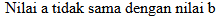

> [! info]- Analisis pembagian !=
>> `$a = 5;` : berfungsi sebagai variable yang memiliki nilai "5"
>> `$b = 10;` : berfungsi sebagai variable yang memiliki nilai "10"
>> `if ($a != $b) { echo "Nilai a tidak sama dengan nilai b";` : jika nilai `$a` dan nilai `$b` tidal sama makan akan menampilkan "Nilai a tidak sama dengan nilai b"
>> `} else { echo "Nilai a sama dengan nilai b";}` : Namun jika nilai `$a` dan nilai `$b` sama maka akan menampilkan hasil "Nilai a sama dengan nilai b"

**Kesimpulan :**
Jadi pada perbandingan != ialah untuk membandingkan variable `$a` dan variable `$a` apakah tidak sama dengan atau tidak.

3. Perbandingan > dan <
```php
if ($a > $b) {
    echo "Nilai a lebih besar dari nilai b";
} else {
    echo "Nilai a tidak lebih besar dari nilai b";
}
```
**Hasil :**
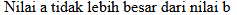

> [! info]- Analisis pembagian < dan >
>> `$a = 5;` : berfungsi sebagai variable yang memiliki nilai "5"
>> `$b = 10;` : berfungsi sebagai variable yang memiliki nilai "10"
>> `if ($a > $b) { echo "Nilai a lebih besar dari nilai b";` : jika nilai `$a` dan nilai `$b` tidal sama makan akan menampilkan "Nilai a lebih besar dari nilai b"
>> `} else { echo "Nilai a tidak lebih besar dari nilai b";}` : Namun jika nilai `$a` dan nilai `$b` sama maka akan menampilkan hasil "Nilai a tidak lebih besar dari nilai b"
>> **Namun jika tandanya berubah `<` maka hasilnya akan sebaliknya**

**Kesimpulan :**
jadi pada perbandingan `>` atau `<` adalah untuk membandingkan nilai dari kedua vaiable dimana salah satunya lebih besar dari atau lebih kecil dari.

4. Perbandingan >= dan =<
```php
if ($a >= $b) {
    echo "Nilai a lebih besar dari atau sama dengan nilai b";
} else {
    echo "Nilai a tidak lebih besar dari atau sama dengan nilai b";
}
```
**Hasil :**
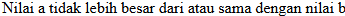

> [! info]- Analisis pembagian >= dan =<
>> `$a = 5;` : berfungsi sebagai variable yang memiliki nilai "5"
>> `$b = 10;` : berfungsi sebagai variable yang memiliki nilai "10"
>> `if ($a >= $b) { echo "Nilai a lebih besar dari atau sama dengan nilai b";` : jika nilai `$a` dan nilai `$b` tidal sama makan akan menampilkan "Nilai a lebih besar dari atau sama dengan nilai b"
>> `} else { echo "Nilai a tidak lebih besar dari atau sama dengan nilai b` : Namun jika nilai `$a` dan nilai `$b` sama maka akan menampilkan hasil "Nilai a tidak lebih besar dari atau sama dengan nilai b"
>> **Namun jika tandanya berubah `<=` maka hasilnya akan sebaliknya

**Kesimpulan :**
jadi pada perbandingan `>=` atau `=<` adalah untuk membandingkan nilai dari kedua variable dimana salah satunya lebih besar atau sama dengan atau lebih kecil atau sama dengan.

### Logika
Berikutnya adalah operator logika yang terdiri menjadi tiga jenis yaitu AND, OR dan NOT. Lalu untuk penjelasan tiap materinya akan dijelaskan di bawah ini.
1. Logika AND
```php
$nilai_a = 10;
$nilai_b = 5;
echo ($nilai_a > 0 && $nilai_b > 0) ? "Kedua nilai \$nilai_a dan \$nilai_b positif." : "Salah satu atau kedua nilai \$nilai_a dan \$nilai_b tidak positif.";
```
**Hasil :**
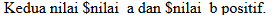

> [! info]- Analisis logika AND
>> `$a = 10;` : berfungsi sebagai variable yang memiliki nilai "10"
>> `$b = 5;` : berfungsi sebagai variable yang memiliki nilai "5"
>> `echo ($nilai_a > 0 && $nilai_b > 0) ?` : akan menampilkan "Kedua nilai 10 dan 5 positif" jika hasilnya true atau akan menampilkan "Salah satu atau kedua nilai 10 dan 5 tidak positif" jika hasil keduanya false

**Kesimpulan :**
jadi pada logika `AND` ini berfungsi untuk memberi penghubung "dan" pada kedua nilai seperti pada contoh di atas yang akan menmpilkan nilai dari variable `$nilai_a` **DAN** variable `$nilai_b`.

2. Logika OR 
```php
$usia = 25;
echo ($usia < 18 || $usia > 60) ? "Anda tidak termasuk dalam rentang usia yang diizinkan." : "Anda termasuk dalam rentang usia yang diizinkan.";
```
**Hasil :**
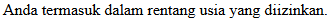

> [! info]- Analisis logika OR
>> `$a = 10;` : berfungsi sebagai variable yang memiliki nilai "10"
>> `$b = 5;` : berfungsi sebagai variable yang memiliki nilai "5"
>> `echo ($usia < 18 || $usia > 60) ?` : akan menampilkan salah nilai jika salah satu nilainya bernilai bernilai true.

**kesimpulan :**
jadi pada logika `OR` berfungsi untuk memilih salah satu dari nilai seperti pada contoh di bawah ini di mana apakah usianya di bawah 18 **ATAU** di atas 60 tahun.

3. Logika NOT
```php
$telah_login = false;
echo (!$telah_login) ? "Anda belum login." : "Anda sudah login.";
```
**Hasil :**
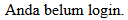

> [! info]- Analisis logika NOT
>> `$a = 10;` : berfungsi sebagai variable yang memiliki nilai "10"
>> `$b = 5;` : berfungsi sebagai variable yang memiliki nilai "5"
>> `echo (!$telah_login) ?` : akan menampilkan nilai kebalik dari nilai yang di inputkan.

**Kesimpulan :**
jadi Program menggunakan operator NOT (`!`) untuk membalikkan nilai variabel `$telah_login`. Jika `$telah_login` adalah `false` (pengguna belum login), maka NOT akan mengubahnya menjadi `true`, sehingga program menampilkan "Anda belum login." Jika `$telah_login` adalah `true` (pengguna sudah login), NOT akan mengubahnya menjadi `false`, sehingga program menampilkan "Anda sudah login.

## Conditional Statement
sekarang kita akan mempelajari apabila suatu program yang mengharuskan kita untuk menjalankan salah satu kondisi dari banyak kemungkinan, untuk materi yang akan kita pelajari ialah IF, IF ELSE, IF ELSE ELSE dan Switch Case. Untuk penjelasan lebih lanjutnya akan dijelaskan di bawah ini
### IF
"IF" ini adalah sebuah kode yang dapat membuat kita menjalankan salah satu dari dua kindisi yang akan di jalankan. Dan berikut adalah contoh penggunaan dan pengaplikasiannya.
```php
$nilai_a = 10;
$nilai_b = 5;
if (nilai_a > nilai_b) {
  echo "Have a good day!";
}
```
**Hasil :**
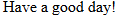

> [! info]- Analisis IF
>> `$a = 10;` : berfungsi sebagai variable yang memiliki nilai "10"
>> `$b = 5;` : berfungsi sebagai variable yang memiliki nilai "5"
>> `if (nilai_a > nilai_b) {echo "Have a good day!";` : jika nilai a > nilai b maka program akan menampilkan "have a good day!"

**Kesimpulan :**
Kesumpulannya adalah pada program **IF** jika syarat terpenuhi maka program akan menampilkan statement dari **IF** seperti yang terlihat pada program di atas.

### IF ELSE
```php
$nilai_a = 10;

if ($nilai_a < "15") {
  echo "Have a good day!";
} else {
  echo "Have a good night!";
}
```
**Hasil :**


> [! info]- Analisis IF ELSE
>> `$a = 10;` : berfungsi sebagai variable yang memiliki nilai "10"
>> `if ($nilai_a < "15") {echo "Have a good day!";} else {echo "Have a good night!";}` : program akan menampilkan "Have a good day!" jika nilai a < 15 dan jika tidak maka akan menampilkan "Have a good night"

**Kesmipulan :**
Kesimpulannya adalah program akan menampilkan statement dari **IF (kondisi pertama)** jika syarat terpenuhi namun jika syarat tidak terpenuhi maka program akan turun ke **ELSE** untuk menjalankan statement dari **ELSE** karena syarat **IF** tidak dapat terpenuhi. 

### IF ELSE ELSE
```php
$nilai_a = 10;

if ($nilai_a < "9") {
  echo "Have a good morning!";
} elseif ($nilai_a < "11") {
  echo "Have a good day!";
} else {
  echo "Have a good night!";
}
```
**Hasil :**


> [! info]- Analisis IF ELSE ELSE
>> `$a = 10;` : berfungsi sebagai variable yang memiliki nilai "10"
>> `if ($t < "9") {echo "Have a good morning!";` : jika nilai_a < 9 maka akan menampilkan "have a good morning!"
>> `} elseif ($nilai_a < "11") {echo "Have a good day!";` : jika nilai_a < 11 maka akan menampilkan "Have a good day!"
>> `} else {echo "Have a good night!";}` : jika tidak termasuk dari kedua kondisi maka akan menampilkan "Have a good night"

**Kesimpulan :**
Kesimpulannya adalah program akan menampilkan statement dari **IF (kondisi pertama)** jika syarat terpenuhi namun jika syarat tidak terpenuhi maka program akan turun ke **ELSE IF (kondisi kedua)** dan menampilkan statementnya apabila syarat terpenuhi namun bila tidak program akan turun ke **ELSE** dan menjalan kan statement dari **ELSE** karena kedua kondisi di atas syaratnya tidak terpenuhi.

### Switch Case
```php
$favcolor = "red";
switch ($favcolor) {
  case "red":
    echo "Your favorite color is red!";
  case "blue":
    "Your favorite color is blue!";
    break;
  case "green":
    echo "Your favorite color is green!";
    break;
  default:
    echo "Your favorite color is neither red, blue, nor green!";
}
```
**Hasil :**
!

> [! info]- Analisis Switch Case
>> `$favcolor = "red";` : adalah sebuah variable yang menyimpan nilai "red"
>> `case "red": echo "Your favorite color is red!";` : pada baris ini program akan menampilkan teks "your favorite color is red" jika kondis terpenuhi dan akan turun kebawah jika kondisi tidak terpenuhi.
>> `break;` : break untuk menahan program jika syarat terpenuhi

**Kesimpulan :**
Program akan menjalankan kode program dari atas, jika syarat terpenuhi maka akan menampilkan statement dari kondisinya dan akan dihentikkan disitu (kode lain di abaikan), namun jika tidak program akan terus turun ke bawah mencari syarat yang terpenuhi, dan apabila masih tidak ada maka akan dijalankan **default**.

## Array
array adalah metode untuk menyimpan suatu data di variable secara terstruktur agar data yang disimpan data tertata dan data menyimpan banyak data.
### Array 1 dimensi
```php
$cars = array("Volvo", "BMW", "Toyota");
echo $cars[0];
```
**Hasil :**
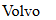

> [! info]- Analisis Array 1 Dimensi
>> `$cars` : adalah nama dari variable yang menyimpan nilai nilai di dalamnya.
>> `("Volvo", "BMW", "Toyoto");` : adalah nilai data yang berada di dalam array.
>> `echo` : adalah perintah untuk menampilkan nilai.
>> `$cars[0]` : adalah perintah untuk memanggil nilai pertama pada baris array.

**Kesimpulan :**
program di atas menyimpan data dalam variable `$cars` dan di atur di dalam array menjadi satu baris sehingga terstruktur. lalu dapat di panggil dengan menyebutkan nama variable dan ditambah `[urutan nilai di dalam arraynya]`.
### Array Asosiatif
```php
$car = array("brand"=>"Ford", "model"=>"Mustang", "year"=>1964);
echo $car["model"];
```
**Hasil :**
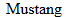

> [! info]- Analisis Array Asosiatif
>> `$cars` : adalah nama dari variable yang menyimpan nilai nilai di dalamnya.
>> `("brand"=>"Ford", "model"=>"Mustang", "year"=>1964);` : ialah nama dan isi nilai dari array.
>> `echo` : adalah perintah untuk menampilkan nilai.
>> `$cars["models"]` : adalah perintah untuk memanggil nilai pada array.

**Kesimpulan :**
program di atas menyimpan data dalam variable `$cars` dan di atur di dalam array menjadi satu baris, namun terdapat nama penanda untuk nilai dari isi penanda tersebut sehingga untuk memanggil arraynya kita hanya perlu menuliskan nama penandanya, contohnya ialah seperti berikut `echo $car["model"];`.

### Array Multidimensi
```php
$cars = array (
  array("Volvo",22,18),
  array("BMW",15,13),
  array("Saab",5,2),
  array("Land Rover",17,15)
);
```
**Hasil :**
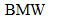

> [! info]- Analisis Array Asosiatif
>> `$cars` : adalah nama dari variable yang menyimpan nilai nilai di dalamnya.
>>`array("Volvo",22,18),``array("BMW",15,13),``array("Saab",5,2),``array("Land Rover",17,15)` : adalah isi dari array multidimensi yang terdiri dari beberapa baris

**Kesimpulan :**
Array kali ini dapat menyimpan sangat banyak data dan di bagi dalam bermacam macam bagain array sehingga menjadi lebih terstruktur seperti yang bisa kita lihat di atas.
## Var_Dump
`var_dump` pada PHP adalah sebuah fungsi yang digunakan untuk menampilkan informasi rinci tentang satu atau beberapa variabel. Fungsi ini mencetak tipe data dan nilai dari variabel tersebut, termasuk struktur data untuk array dan objek. `var_dump` sangat berguna untuk debugging karena memberikan gambaran lengkap tentang isi dari variabel yang sedang diperiksa.
```php
php $angka = 123; var_dump($angka);
```
**Hasil :**
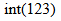

**Kesimpulan :**
`var_dump` akan menampilkan informasi rinci program yang telah kita ketikkan 

## Looping (Pengulangan)
  
Looping atau pengulangan pada PHP adalah cara untuk mengeksekusi serangkaian pernyataan atau blok kode secara berulang berdasarkan kondisi tertentu.
### For
```php
for ( $nilai_a = 0; $nilai_a <= 5; $nilai_a++) {
  echo "ini perulangan yang: $nilai_a <br>";
}
```
**Hasil** :
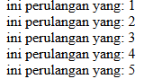

> [! info]- Analisis WHILE
>>1. `for (`: Ini menandakan awal dari deklarasi for loop.
>> 2. `$nilai_a = 0;`: Inisialisasi variabel `$nilai_a` dengan nilai 0.
>> 3. `$nilai_b <= 10;`: Ini adalah kondisi untuk loop. Loop akan terus berjalan selama nilai dari variabel `$nilai_b` kurang dari atau sama dengan 10. Namun, perlu dicatat bahwa di dalam loop tidak ada pernyataan yang mengubah nilai variabel `$nilai_b`, jadi jika tidak ada perubahan nilai di luar loop, kondisi ini akan selalu benar dan loop akan menjadi loop tak terbatas. Mungkin ada kesalahan karena variabel `$nilai_b` belum didefinisikan sebelumnya.
>>4. `$nilai_a++`: Setiap kali iterasi dilakukan, nilai dari variabel `$nilai_a` akan bertambah satu.
>>

**Kesimpulan** :
Kode ini mencoba untuk membuat perulangan menggunakan for loop dengan inisialisasi variabel `$nilai_a` di 0 dan kondisi loop berdasarkan variabel `$nilai_b`, yang tidak didefinisikan sebelumnya.
 Karena variabel `$nilai_b` tidak didefinisikan sebelumnya dan tidak ada pernyataan yang mengubah nilainya dalam loop, maka loop ini akan menjadi loop tak terbatas, terus mencetak pesan "ini perulangan yang:" diikuti dengan nilai `$nilai_a`, terus menerus tanpa berhenti sampai dihentikan secara manual atau hingga batas eksekusi PHP tercapai.
 Untuk memperbaiki loop ini, pastikan untuk menentukan kondisi yang tepat dan inisialisasi variabel yang sesuai sebelum memulai loop.

### While
```php
$nilai = 1;
while ($nilai < 6) {
  echo $nilai;
  $nilai++;
}
```
**Hasil :**
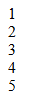

> [! info]- Analisis WHILE 
> >> 1. `$nilai = 1;`: Variabel `$nilai` diinisialisasi dengan nilai 1.
>>> 2. `while ($nilai < 6) {`: Loop akan terus berjalan selama nilai dari variabel `$nilai` kurang dari 6.
>> 3. `echo $nilai;`: Setiap iterasi dari loop, nilai dari variabel `$nilai` akan dicetak.
>> 4. `$nilai++;`: Setiap iterasi, nilai variabel `$nilai` akan bertambah satu.

**Kesimpulan** :
Loop while tidak berjalan beberapa kali, tetapi memeriksa setelah setiap iterasi apakah kondisinya masih benar.
Kondisi ini tidak harus menjadi penghitung, bisa jadi status operasi atau kondisi apa pun yang mengevaluasi benar atau salah.
Masukkan teks.

###  Do-While
```php
$nilai= 1;
do {
  echo $nilai;
  $nilai++;
} while ($nilai < 6);
```
**Hasil :**
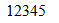

> [! info]- Analisis Do-While
> >> 1. `$nilai = 1;`: Variabel `$nilai` diinisialisasi dengan nilai 1.
>>> 2. `while ($nilai < 6) {`: Loop akan terus berjalan selama nilai dari variabel `$nilai` kurang dari 6.
>> 3. `echo $nilai;`: Setiap iterasi dari loop, nilai dari variabel `$nilai` akan dicetak.
>> 4. `$nilai++;`: Setiap iterasi, nilai variabel `$nilai` akan bertambah satu.

**Kesimpulan :**
Variable `$nilai` berisikan nilai 3 dan di tampilkan di dalam perintah **do** dengan cara mengetikkan `echo`.
setelah menampilkan hasil variable di tambah nilainya dengan perintah `$nilai++` dan programnya akan terus berulang sampai syaratnya tidak terpenuhi lagi, yaitu `($nilai < 6)`.


### Foreach
```php
$numbers = [1, 2, 3, 4, 5]; 
foreach ($numbers as $number) { 
echo "Angka: $number\n"; }
```
**Hasil :**
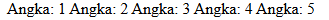

> [! info]- Analisis Foreach
> >> 1. `$nilai = 1;`: Variabel `$nilai` diinisialisasi dengan nilai 1.
>>

**Kesimpulan :**
## Function
```php
function greet($name) { 
echo "Hello, $name!"; } 

greet("Alice");
```
**Hasil :**


> [! info]- Analisis Function
> >> 1. `greet` : adalah nama dari function yang dibuat
> >> 2. `echo "Hello"` : untuk menampilkan hello
> >> 3. `$name` : adalah nama variable yang dijadikan tempat menyimpan data
> >> 4. `("Alice")` : adalah isi nilai dari variable `$nilai`

**Kesimpulan :**
function ini berfungsi untuk menjadi tempat untuk menyimpan data yang bisa di panggil berkali kali dan data atau nilai dari variable akan di isi di bagian bawah, seperti pada contoh di atas yang telah di tuliskan.

## PHP Form
Kode html :
```html
<form>
     <input type="text" name="nama_lengkap" placeholder="Masukkan nama">
     <input type="number" name="umur" placeholder="Masukkan umur"><br>
     <button type="submit">Kirim</button>
</form>
```
**Hasil :**
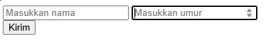

> [! info]- Analisis Form
> >> 1. `input type="text"` : untuk membuat kolom form bertipe text
> >> 2. `input type="number"` : untuk membuat kolom form bertipe nomor 
> >> 3. `placeholder` : berfungsi untuk menampilkan teks pada kolom sebelum ada text yang tertulis
> >> 4. `button type="submit` : berfungsi untuk membuat button bertipe submit

**Kesimpulan :**
form dalam php berfungsi untuk mengambil data yang akan dimasukkan di data base dan proses pembuatannya di lakukan atau diketikkan pada html.

## Get Method
Kode html :
```html
<body>
    <!-- Pada atribut action, kalian tuliskan nama file php yang bertugas untuk mengelola atau menangkap data dari form tersebut. -->
    <form action="proses_get.php" method="GET">
        <input type="text" name="nama" placeholder="Masukkan nama">
        <input type="number" name="umur" placeholder="Masukkan umur"> <br>
        <button type="submit">Kirim</button>
</form>
```
Kode PHP :
```php
<?php
// Key dari array-nya, sesuai dengan nama dari atribut name di setiap input-nya
$nama = $_GET["nama"];
$umur = $_GET["umur"];
?>
<!DOCTYPE html>
<html lang="en">
<head>
    <meta charset="UTF-8">
    <meta name="viewport" content="width=device-width, initial-scale=1.0">
    <title>GET</title>
</head>
<body>
    <p>nama anda <?= $nama ?></p>
    <p>Umur anda <?= $umur ?> tahun</p>
</body>
</html>
```
**Hasil :**
HTML :
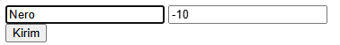
PHP :
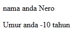

> [! info]- Analisis GET PHP
> >> 1. `<form action="proses_get.php" method="GET">` : berfungsi untuk menghubungkan nilai dari form ke dokumen `proses_get.php`.
> >> 2. `$nama = $_GET["nama"];` berfungsi untuk mengambil nilai dari form yang telah di tulis
> >> 3. `$umur = $_GET["umur"];` berfungsi untuk mengambil nilai dari form yang telah di tulis
> >> 4. `<p>nama anda <?= $nama ?></p>` : untuk menampilkan output dari `$nama`
> >> 5. `<p>umur anda <?= $umur ?></p>` : untuk menampilkan output dari `$umur

**Kesimpulan :** 
Jadi dari page form data akan di ambil dengan action yang di tuliskan pada kode di atas dan di page selanjutnya akan di tampilkan seluruh hasil dari nilai yang telah di input termasuk di antaranya nama dan umur.

## Post Method
Kode Html :
```html
    <form action="proses_post.php" method="POST">
        <input type="text" name="nama_lengkap" placeholder="Masukkan nama">
        <input type="number" name="umur" placeholder="Masukkan umur">
        <input type="password" name="password" placeholder="Masukkan password"><br>
        <button type="submit">Kirim</button>
   </form>
```
Kode PHP :
```php
<?php
// Key dari array-nya, sesuai dengan nama dari atribut name di setiap input-nya
$nama = $_POST["nama"];
$umur = $_POST["umur"];
?>
<!DOCTYPE html>
<html lang="en">
<head>
    <title> XI RPL 1 - POST</title>
</head>
<body>
    <p>Nama anda <?= $nama ?></p>
    <p>Umur anda <?= $umur ?> tahun</p>
    <p>Password anda aman!</p>
</body>
</html>
```
**Hasil :**
HTML :
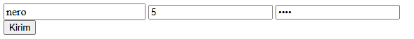
PHP :
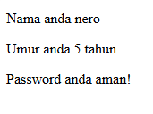

> [! info]- Analisis POST PHP
> >> 1. `<form action="proses_post.php" method="POST">` : berfungsi untuk menghubungkan nilai dari form ke dokumen `proses_POST.php`.
> >> 2. `$nama = $_POST["nama"];` berfungsi untuk mengambil nilai dari form yang telah di tulis
> >> 3. `$umur = $_POST["umur"];` berfungsi untuk mengambil nilai dari form yang telah di tulis
> >> 4. `<p>nama anda <?= $nama ?></p>` : untuk menampilkan output dari `$nama`
> >> 5. `<p>umur anda <?= $umur ?></p>` : untuk menampilkan output dari `$umur

**Kesimpulan :**
POST dan Get memiliki fungsi yang bisa dibilang hampir sama namun pada `POST` data yang dikirim tidak ditampilkan di url sehingga ini sangat cocok pada perpindahan data yang sensitif dan bersifat pribadi.

## Koneksi Database
**Query :**
```php
<?php

//koneksi ke database
$koneksi = mysqli_connect('localhost', 'root', '', 'rental_fadhil');

if ($koneksi) {
    echo "<br> koneksi aman <br>";
} else {
    echo "error, tidak bisa koneksi ke database";
}
?>
```
**Hasil :**
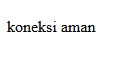

> [! info]- Analisis koneksi
>>`<? Php` tag pembuka php
>>`mysqli_connect()` adalah fungsi yang digunakan untuk membuat koneksi ke server MySQL.
>>`'localhost'` adalah hostname dari server MySQL. Biasanya `localhost` digunakan jika server MySQL berjalan di mesin yang sama dengan server web.
>>`'root'` adalah username yang digunakan untuk login ke server MySQL.
>>`''` adalah tempat untuk password username `root`. karena kosong artinya tidak ada password yang di berikan. 
>>`'rental_nero'` adalah nama database yang ingin diakses.
>>`if ($koneksi)`memeriksa apakah variabel $koneksi berhasil mengembalikan resource koneksi (bernilai true jika berhasil).
>>`echo "<br> koneksi aman <br>"`; menampilkan pesan "koneksi aman" jika koneksi berhasil.
>>`else` digunakan jika koneksi gagal.
>>`echo "error, tidak bisa koneksi ke database";`menampilkan pesan kesalahan jika koneksi gagal.
>>`?>` adalah tag penutup php

**Kesimpulan :**
bertujuan untuk membuat koneksi ke database MySQL menggunakan `mysqli_connect()` dengan parameter hostname (`localhost`), username (`root`), password (kosong), dan nama database (`rental_nero`). Koneksi diperiksa dengan kondisi `if ($koneksi)`; jika koneksi berhasil, ditampilkan pesan "koneksi aman", jika gagal, ditampilkan pesan kesalahan "error, tidak bisa koneksi ke database".

## Tampilkan Data
**Query :**
```php
<?php


echo 'Berikut mobil-mobil beserta pemiliknya<br>';

$a = 1;
foreach ($select as $key => $data) {
    echo $a++ . ". " . $data['no_plat'] . " : " . $data['pemilik'] . '<br>';
}

?>
```
**Hasil :**
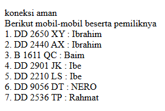

> [! info]- Analisis Tampilkan Data
>>`<?Php` tag pembuka php
>>`echo 'Berikut mobil-mobil beserta pemiliknya<br>'; ` Menampilkan teks pengantar untuk daftar mobil.`<br>`menambahkan baris baru setelah teks.
>>`$a = 1;` Mendefinisikan variabel `$a` dengan nilai awal 1. Variabel ini digunakan untuk memberi nomor urut pada daftar mobil.
>>`foreach ($select as $key => $data)` adalah loop yang mengiterasi setiap elemen dalam array $select.
>>`$key` adalah indeks dari elemen dalam array $select.
>>`$data` adalah nilai dari elemen dalam array $select.
>>`echo $a++ . ". " . $data['no_plat'] . " : " . $data['pemilik'] . '<br>';` menampilkan nomor urut, nomor plat mobil, dan pemilik mobil dari array $data.
>>`$a++` menambah nilai $a setelah digunakan, sehingga memberikan nomor urut untuk setiap item.
>>`?>` tag penutup php

**Kesimpulan :**
Kode menggunakan echo untuk mencetak teks HTML dan variabel dari array. Nomor urut ditampilkan menggunakan variabel $a yang diincrement setiap iterasi dalam loop foreach. Kode ini memanfaatkan data dari array $result untuk menampilkan nama pemilik dan array $select untuk menampilkan informasi mobil.

## Tambahkan Data
**Query :**
```Php
<?php
include 'database.php';

if ($_SERVER["REQUEST_METHOD"] == "POST") {
    $no_plat = $_POST['no_plat'];
    $no_mesin = $_POST['no_mesin'];
    $warna = $_POST['warna'];
    $pemilik = $_POST['pemilik'];
    $peminjam = $_POST['peminjam'];
    $harga_rental = $_POST['harga_rental'];

    $query = "INSERT INTO mobil (no_plat, no_mesin, warna, pemilik, peminjam, harga_rental) VALUES ('$no_plat', '$no_mesin', '$warna', '$pemilik', '$peminjam', '$harga_rental')";
    
    if (mysqli_query($koneksi, $query)) {
        header("Location: index.php");
    } else {
        echo "Error: " . $query . "<br>" . mysqli_error($koneksi);
    }
}
?>

<!DOCTYPE html>
<html>
<head>
    <title>Tambah Data Mobil</title>
</head>
<body>
    <h1>Tambah Data Mobil</h1>
    <form method="post" action="tambah.php">
        <label>No Plat:</label><br>
        <input type="text" name="no_plat"><br>
        <label>No Mesin:</label><br>
        <input type="text" name="no_mesin"><br>
        <label>Warna:</label><br>
        <input type="text" name="warna"><br>
        <label>Pemilik:</label><br>
        <input type="text" name="pemilik"><br>
        <label>Peminjam:</label><br>
        <input type="text" name="peminjam"><br>
        <label>Harga Rental:</label><br>
        <input type="number" name="harga_rental"><br>
        <input type="submit" value="Tambah">
    </form>
</body>
</html>
```
**Hasil :**

### Penjelasan
- `include 'database.php';`: mengimpor file database.php, yang mungkin berisi informasi koneksi ke database (seperti hostname, username, password, dan nama database).
- `if ($_SERVER["REQUEST_METHOD"] == "POST") {`: memeriksa apakah metode request adalah POST. Ini berarti bahwa form telah disubmit oleh pengguna.
- `$no_plat = $_POST['no_plat'];  ​$no_mesin = $POST['no_mesin']; ​$warna = $POST['warna'];$pemilik = $_POST['pemilik'];  ​$peminjam = $_POST['peminjam'];$harga_rental = $_POST['harga_rental'];` : Baris-baris ini mengambil data dari form yang telah disubmit menggunakan metode POST dan menyimpannya dalam variabel PHP. Variabel ini akan digunakan untuk menyusun query SQL.
- `$query = "INSERT INTO mobil (no_plat, no_mesin, warna, pemilik, peminjam, harga_rental) VALUES ('$no_plat', '$no_mesin', '$warna', '$pemilik', '$peminjam', '$harga_rental')";`: Baris ini membentuk query SQL yang akan menyisipkan data ke dalam tabel mobil. Data diambil dari variabel yang sudah diisi sebelumnya.
- `if (mysqli_query($koneksi, $query)) {    header("Location: index.php");`: Baris ini menjalankan query SQL. Jika eksekusi query berhasil, pengguna akan dialihkan ke halaman index.php.
- `} else {     echo "Error: " . koneksi)  }}`:Jika eksekusi query gagal, baris ini akan menampilkan pesan error yang menjelaskan kesalahan yang terjadi. mysqli_error($koneksi) menampilkan pesan kesalahan yang diberikan oleh MySQL.
- ``<!DOCTYPE html>`
`<html>`
`<head>`
    `<title>Tambah Data Mobil</title>`
`</head>`
`<body>`
 `<h1>Tambah Data Mobil</h1>`: Bagian ini adalah awal dari dokumen HTML. Deklarasi `<!DOCTYPE html>`menentukan tipe dokumen sebagai HTML5. Elemen html adalah root dari dokumen HTML. Elemen head berisi informasi meta, seperti title yang menentukan judul halaman. Elemen body berisi konten halaman web yang akan ditampilkan kepada pengguna.
 - `<form method="post" action="tambah.php">`: **Baris ini memulai form HTML**. Form ini menggunakan metode POST untuk mengirimkan data ke `tambah.php` saat disubmit.
 - `<label>No Plat:</label><br>`
       `<input type="text" name="no_plat"><br>`
        `<label>No Mesin:</label><br>`
        `<input type="text" name="no_mesin"><br>`
        `<label>Warna:</label><br>`
        `<input type="text" name="warna"><br>`
        `<label>Pemilik:</label><br>`
        `<input type="text" name="pemilik"><br>`
        `<label>Peminjam:</label><br>`
       ` <input type="text" name="peminjam"><br>`
        `<label>Harga Rental:</label><br>`
        `<input type="number"` `name="harga_rental"><br>`:
        Baris-baris ini membuat elemen input dalam form. Setiap pasangan `<label>` dan `<input>` membuat label dan field input untuk data mobil yang berbeda (no plat, no mesin, warna, pemilik, peminjam, harga rental). `<br>` digunakan untuk membuat baris baru setelah setiap elemen input.
- `<input type="submit" value="Tambah">`
    `</form>`
- `</body> </html>`: Baris ini menambahkan tombol submit yang ketika diklik akan mengirimkan data form ke tambah.php. Form kemudian ditutup dengan tag `</form>`. Bagian body dan html ditutup dengan tag penutup masing-masing.

## Ubah Data
**Query :**
```php
<!DOCTYPE html>
<html lang="en">
<head>
    <title>Document</title>
</head>
<body>
    <h2>Ubah Data</h2>
    <?php
    include "koneksi.php";

    $id = $_GET['id'];

    if (isset($_POST['simpan'])) {
        $nama = $_POST['nama'];
        $email = $_POST['email'];
        $jenis_kelamin = $_POST['jenis_kelamin'];
        $alamat = $_POST['alamat'];
        
        $query = mysqli_query($koneksi, "UPDATE siswa SET
                                        nama='$nama',
                                        email='$email',
                                        jenis_kelamin='$jenis_kelamin',
                                        alamat='$alamat'
                                        WHERE id_siswa=$id");
        if ($query) {
            echo "<script>
            alert('ubah data Berhasil')
            window.location.href='table.php'
            </script>";
        } else {
            echo '<script>alert("ubah data gagal")</script>';
        }
    }
    $query = mysqli_query($koneksi, "SELECT * FROM siswa where id_siswa=$id");
    $data = mysqli_fetch_array($query);
    if ($data == "") {
        die('Data tidak ada');
    }
    ?>
    <form method="post">
        <table>
            <tr>
                <td>Nama</td>
                <td><input type="text" value="<?= $data['nama'] ?>" name="nama"></td>
            </tr>
            <tr>
                <td>Email</td>
                <td><input type="text" value="<?= $data['email'] ?>" name="email"></td>
            </tr>
            <tr>
                <td>Jenis Kelamin</td>
                <td>
                    <select name="jenis_kelamin">
                        <option <?php if ($data['jenis_kelamin'] == "laki-laki")
                            echo 'selected'; ?>>Laki-laki</option>
                        <option <?php if ($data['jenis_kelamin'] == "perempuan")
                            echo 'selected'; ?>>Perempuan</option>
                    </select>
                </td>
            </tr>
            <tr>
                <td>Alamat</td>
                <td><input type="text" value="<?= $data['alamat'] ?>" name="alamat"></td>
            </tr>
            <tr>
                <td></td>
                <td>
                    <button name="simpan" type="submit">Ubah</button>
                    <button type="reset">Reset</button>
                    <a href="table.php">Kembali</a>
                </td>
            </tr>
        </table>
    </form>
</body>
</html>
```
**Hasil :**

### Penjelasan
- `include "koneksi.php";` : 
- 1. `include "koneksi.php";` : Menyertakan file `koneksi.php` untuk menghubungkan ke database.
- 2. `$id = $_GET['id'];` : Mengambil nilai `id` dari parameter URL untuk menentukan data yang akan diubah.
- 3.`if (isset($_POST['simpan'])) {` : Mengecek apakah tombol "simpan" telah diklik, yang menunjukkan bahwa formulir telah disubmit.
- 4. ```php
	$nama = $_POST['nama'];
	$email = $_POST['email'];
	$jenis_kelamin = $_POST['jenis_kelamin'];
	$alamat = $_POST['alamat'];``` : Mengambil data yang diinput pengguna dari formulir.
- 5. ``` $query = mysqli_query($koneksi, "UPDATE siswa SET
                                 nama='$nama',
                                 email='$email',
                                 jenis_kelamin='$jenis_kelamin',
                                 alamat='$alamat'
                                 WHERE id_siswa=$id");
	```: Menjalankan query untuk memperbarui data siswa dalam database berdasarkan `id`.
- 6. ```if ($query) {
    echo "<script>
    alert('ubah data Berhasil')
    window.location.href='table.php'
    </script>";
	} else {
    echo '<script>alert("ubah data gagal")</script>';
	}
``` : Menampilkan pesan keberhasilan atau kegagalan setelah query dijalankan dan mengarahkan kembali ke halaman `table.php` jika berhasil.
- 7. ```$query = mysqli_query($koneksi, "SELECT * FROM siswa where id_siswa=$id");
	$data = mysqli_fetch_array($query);
	if ($data == "") {
    die('Data tidak ada');
	}
	``` :Menjalankan query untuk mengambil data siswa berdasarkan `id` dan menampilkannya di formulir jika data ditemukan, atau menampilkan pesan kesalahan jika data tidak ditemukan.

## Hapus Data
**Query :**
```php
<?php
include('koneksi.php');
if(isset($_GET['id'])){
    $id = $_GET['id'];
    $query = mysqli_query($koneksi, "DELETE FROM siswa WHERE id_siswa = $id");
   if($query) {
            echo "<script>
            alert('Hapus data Berhasil')
            window.location.href='table.php'
            </script>";
        }else {
            echo '<script>alert("Hapus data gagal")</script>';
        }
}
?>
```
**Hasil :**
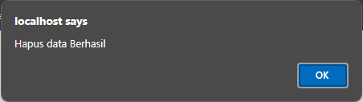

### Penjelasan
- `<?php include('koneksi.php');` : - Menyertakan file `koneksi.php` untuk menghubungkan ke database.
- `if(isset($_GET['id'])){ $id = $_GET['id'];` : - Mengecek apakah parameter `id` ada di URL, kemudian menyimpan nilai `id` tersebut ke dalam variabel `$id`.
-  `$query = mysqli_query($koneksi, "DELETE FROM siswa WHERE id_siswa = $id");` : - Menjalankan query untuk menghapus data siswa dari database berdasarkan `id` yang diperoleh dari URL.
-     ```if($query) {
        echo "<script>
        alert('Hapus data Berhasil')
        window.location.href='table.php'
        </script>";
	    } else {
        echo '<script>alert("Hapus data gagal")</script>';
	    }
		}
		?>``` 
: - Mengecek apakah query berhasil dijalankan. Jika berhasil, menampilkan pesan sukses dan mengarahkan pengguna kembali ke halaman `table.php`. Jika gagal, menampilkan pesan kegagalan.

## Session / Login
**Query :**
```php
<?php

session_start();

if (isset($_POST['submit'])) {
    $username = $_POST['username'];
    $password = $_POST['password'];

    $koneksi = mysqli_connect('localhost', 'root', '', 'pemilu_test') or die('error koneksi');

    $result = mysqli_query($koneksi, "SELECT * FROM user 
                            WHERE username = '$username' AND password = '$password'");

    $data = mysqli_fetch_assoc($result);

    if (isset($data)) {
        $_SESSION['username'] = $data['username'];
        $_SESSION['nama'] = $data['nama'];
        $_SESSION['status'] = 'login';
        header('Location: user.php');
    } else {
        echo "Username dan Password Salah";
    }
}


?>
<!DOCTYPE html>
<html>

<head>
    <title>Login Session</title>
</head>

<body>

    <form method="post">
        <label>Username</label>
        <input type="text" name="username">
        <br>
        <label>Password</label>
        <input type="text" name="password">
        <br>
        <button type="submit" name="submit">Login</button>
    </form>

</body>

</html>
```
**Hasil :**
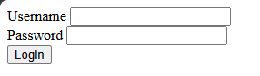

**Query Log out :**
```php
<?php
session_start();

session_destroy();
session_unset();

header('Location: login.php');

## Upload & Download 
```
**Hasil :**
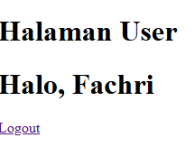

### Penjelasan Login
- `session_start();` :  Memulai atau melanjutkan sesi pengguna.
- `if (isset($_POST['submit'])) {` : Memeriksa apakah form telah disubmit.
- `$username = $_POST['username'];$password = $POST['password']; ` : Mengambil username dan password dari form.
- `$koneksi = mysqli_connect('localhost', 'root', '', 'pemilu_test') or die('error koneksi');` : Menghubungkan ke database pemilu_test.
- `$result = mysqli_query($koneksi, "SELECT * FROM user WHERE username = '$username' AND password = '$password'");` : Menjalankan query untuk memeriksa username dan password.
- `$data = mysqli_fetch_assoc($result);`: Mengambil data pengguna dari hasil query.
- `if (isset($data)) {  ​$SESSION['username'] = $data['username'];  ​$SESSION['nama'] = $data['nama'];$_SESSION['status'] = 'login'; header('Location: user.php');} else { echo "Username dan Password Salah";}`: Jika cocok, mengatur variabel sesi dan mengarahkan ke user.php. Jika tidak cocok, menampilkan pesan kesalahan.
```
<!DOCTYPE html>
<html>
<head>
    <title>Login Session</title>
</head>
<body>
    <form method="post">
        <label>Username</label>
        <input type="text" name="username">
        <br>
        <label>Password</label>
        <input type="text" name="password">
        <br>
        <button type="submit" name="submit">Login</button>
    </form>
</body>
</html>

```
Menampilkan form login untuk memasukkan username dan password.
### Penjelasan Log out 
- Sesi Dimulai: Jika belum ada sesi yang berjalan, `session_start()` akan memulai sesi baru atau melanjutkan sesi yang ada.
- Sesi Dihancurkan: `session_destroy()` akan menghapus data sesi dari server, mengakhiri sesi pengguna saat ini.
- Variabel Sesi Dihapus: `session_unset()` memastikan bahwa semua variabel sesi yang ada dihapus.
- Pengalihan ke Halaman Login: `header('Location: login.php')` mengarahkan pengguna ke halaman login, yang biasanya berarti pengguna perlu masuk kembali untuk mengakses bagian yang dilindungi dari situs.


## Upload / Download
### Download
```php
<?php
include "koneksi.php";

$query = mysqli_query($koneksi, 'SELECT * FROM siswa');
$data = [];
$data[] = ["ID", "Nama", "Email", "Jenis Kelamin", "Alamat"];
while ($row = mysqli_fetch_assoc($query)) {
    $data[] = [
        $row['id_siswa'],
        $row['nama'],
        $row['email'],
        $row['jenis_kelamin'],
        $row['alamat']
    ];
}
$namafile = "excel_data.xls";
header("Content-Type: application/vnd.ms-excel");
header("Content-Disposition: attachment;filename=\"$namafile\"");
header("Cache-Control: max-age=0");
$output = fopen("php://output", "w");
foreach ($data as $row) {
    fputcsv($output, $row, "\t");
}
fclose($output);
exit;
```
**Hasil :**
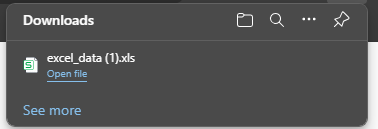

### Penjelasan
- `<!DOCTYPE html>`: Mendefinisikan versi HTML yang digunakan, ini HTML5.
- `<html lang="en">`: Menentukan bahasa dokumen sebagai bahasa Inggris.
- `<head>`: Berisi informasi meta seperti tag meta, judul, dan referensi ke file eksternal.
- `<meta charset="UTF-8">`: Mendefinisikan pengkodean karakter sebagai UTF-8, standar untuk pengkodean karakter.
- `<meta name="viewport" content="width=device-width, initial-scale=1.0">`: Menyetel area pandang untuk desain web responsif.
- `<title>index tabel</title>`: Menyetel judul dokumen HTML.
- `<body>`: Berisi konten yang ditampilkan pada halaman web.
- `<h2>Data Mobil</h2>`: Membuat heading level 2 dengan teks "Data Mobil".
- `<a href="tambah.php">+Tambah Data Baru</a><br><br>`: Membuat hyperlink ke "tambah.php" dengan teks "+Tambah Data Baru" diikuti dengan dua baris baru.
- `<p><a href="ekspor.php">Eksport Excel</a></p>`: Membuat paragraf dengan hyperlink ke "ekspor.php" dengan teks "Eksport Excel".
- `<table border="5">`: Membuat tabel dengan ketebalan batas 5 piksel.
- `<tr>...</tr>`: Mewakili baris dalam tabel.
- `<th>...</th>`: Mendefinisikan sel header (kolom) dalam tabel.
- `<td>...</td>`: Mendefinisikan sel data dalam tabel.
- `<?php ... ?>`: Menyematkan kode PHP ke dalam dokumen HTML untuk konten atau logika dinamis.
- `include "koneksi.php";: Termasuk file "koneksi.php" yang berisi koneksi database.
- `$query = mysqli_query($koneksi, "SELECT * FROM mobil");`: Menjalankan kueri SQL untuk mengambil data dari tabel "mobil" di database yang terhubung.
- `while ($data = mysqli_fetch_array($query)) { ... }`: Mengulang setiap baris hasil kueri dan menampilkannya dalam tabel.
- `" width="100">`: Menampilkan gambar yang bersumber dari folder "img" menggunakan URL gambar yang diambil dari database.
- `<a href="update.php?id=<?= $data['id_mobil']; ?>">Ubah</a> | <a href="delete.php?id=<?= $data['id_mobil']; ?>">Hapus</a> |`: Membuat hyperlink untuk memperbarui dan menghapus data mobil tertentu menggunakan parameter ID dari setiap baris data.

### Upload
**Query :**
```php
<!DOCTYPE html>
<html lang="en">
<head>
    <title>Document</title>
</head>
<body>
    <h2>Tambah Data</h2>
    <?php

    include "koneksi.php";
    function upload(): string
    {
        $nameImage = $_FILES['gambar']['name'];
        $directoryFile = $_FILES['gambar']['tmp_name'];
        $errorImage = intval($_FILES['gambar']['error']);
        $sizeFile = $_FILES['gambar']['size'];

        // cek apakah6 gambar ada
        if ($errorImage === 4) {
            echo "<script>alert('Anda Belum Upload Gambar')</script>";
            return false;
        }

        // mengambil ekstensi file

        $validType = ['svg', 'jpg', 'png', 'jpeg', 'webp'];
        $extensionFile = explode(".", $nameImage);
        $extensionValid = strtolower(end($extensionFile));

        // cek apakah yang diupload gambar atau bukan
        if (!in_array($extensionValid, $validType)) {
            echo "<script>alert('yang anda Upload bukan gambar')</script>";
            return false;
        }
        
        // cek size file
        if ($sizeFile > 3_000_000) {
            echo "<script>alert('Ukuran File Terlalu Besar!!(Maks 3MB)')</script>";
            return false;
        }
        
        // upload file
        $nameImage = uniqid() . "." . $extensionValid;
        move_uploaded_file($directoryFile, "img/{$nameImage}");

```
**Hasil :**
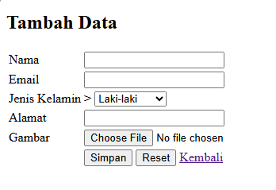
### Penjelasan
- `<!DOCTYPE html>`: Mendefinisikan versi HTML yang digunakan, ini HTML5.
- `<html lang="en">`: Menentukan bahasa dokumen sebagai bahasa Inggris.
- `<head>`: Berisi informasi meta seperti tag meta, judul, dan referensi ke file eksternal.
- `<meta charset="UTF-8">`: Mendefinisikan pengkodean karakter sebagai UTF-8, standar untuk pengkodean karakter.
- `<meta name="viewport" content="width=device-width, initial-scale=1.0">`: Menyetel area pandang untuk desain web responsif.
- `<title>Document</title>`: Menyetel judul dokumen HTML.
- `<body>`: Berisi konten yang ditampilkan pada halaman web.
- `<h2>Tambah Data</h2>`: Membuat heading level 2 dengan teks "Tambah Data".
- `include "koneksi.php";` : untuk menghubungkan dengan `koneksi.php`
- $nameImage = $_FILES`['gambar']['name']`;  : Mengambil nama asli file gambar yang diunggah dan menyimpannya dalam variabel $nameImage.
- $directoryFile = $_FILES`['gambar']['tmp_name']`; Mengambil lokasi sementara file gambar yang diunggah di server dan menyimpannya dalam variabel $directoryFile.
- $errorImage = intval($_FILES`['gambar']['error']`); : Mengambil kode kesalahan dari proses upload file, mengonversinya menjadi integer, dan menyimpannya dalam variabel $errorImage.
- $sizeFile = $_FILES`['gambar']['size']`; : Mengambil ukuran file gambar yang diunggah dalam byte dan menyimpannya dalam variabel $sizeFile.
- `if ($errorImage === 4) { echo "<script>alert('Anda Belum Upload Gambar')</script>"; return false; }` : Mengecek apakah ada file yang diunggah dengan melihat kode kesalahan. Jika kode kesalahan adalah 4 (berarti tidak ada file yang diunggah), maka menampilkan pesan peringatan dan menghentikan eksekusi fungsi.
- Membuat daftar ekstensi file yang valid dalam array` $validType`.
- Memecah nama file berdasarkan tanda titik (.) untuk mengambil ekstensi file dan menyimpannya dalam variabel `$extensionFile`.
- Mengambil ekstensi terakhir dari file (bagian setelah titik terakhir) dan mengonversinya menjadi huruf kecil, menyimpannya dalam variabel `$extensionValid`.
- `if (!in_array($extensionValid, $validType)) { echo "<script>alert('yang anda Upload bukan gambar')</script>"; return false;` : Mengecek apakah ekstensi file yang diunggah termasuk dalam daftar ekstensi yang valid. Jika tidak, menampilkan pesan peringatan dan menghentikan eksekusi fungsi.
- `if ($sizeFile > 3_000_000) { echo "<script>alert('Ukuran File Terlalu Besar!!(Maks 3MB)')</script>"; return false; }` : - Mengecek apakah ukuran file yang diunggah melebihi 3MB (3.000.000 byte). Jika ya, menampilkan pesan peringatan dan menghentikan eksekusi fungsi.
- Menghasilkan nama file baru yang unik dengan menambahkan ekstensi yang valid, dan menyimpannya dalam variabel `$nameImage`.
- Memindahkan file dari lokasi sementara ke direktori tujuan `(img/)` dengan nama file yang baru dibuat.

